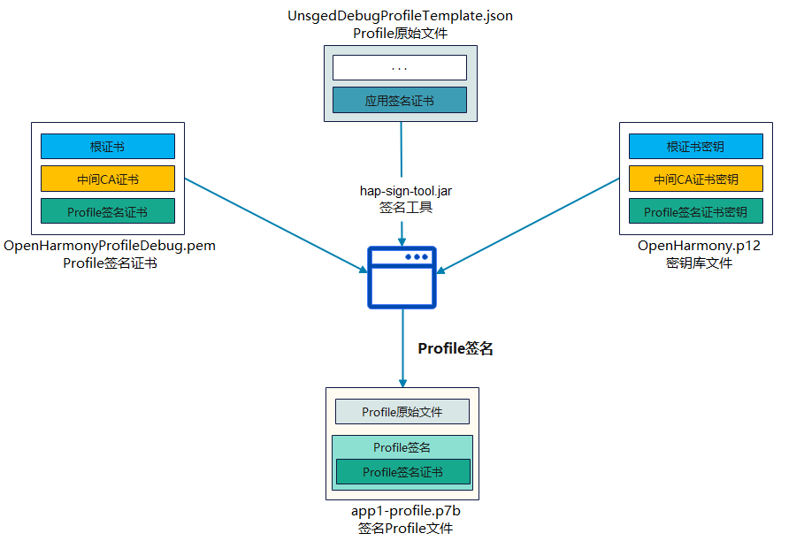
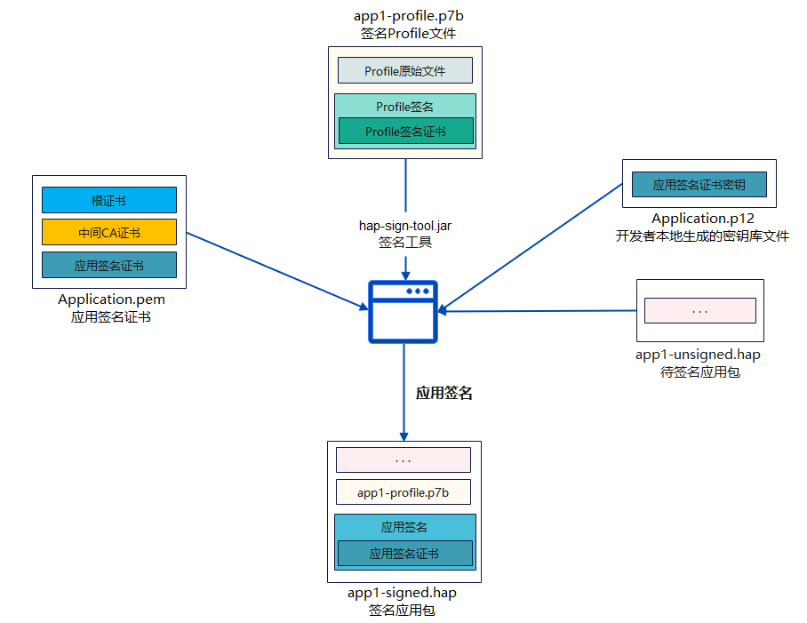

# 应用包签名工具

* 简介
* 目录
* 约束
* 编译构建
* 说明
  * 签名相关文件用法说明
  * 使用说明 
  * 接口说明 
* 相关仓

#### 简介

为了保证OpenHarmony应用和二进制工具（如：lldb-server）的完整性和来源可靠，需要对应用和二进制工具进行签名。经过签名的应用和二进制工具才能在真机设备上安装、运行和调试。本仓提供了签名工具的源码，包含密钥对生成、CSR文件生成、证书生成、Profile文件签名、应用包签名、二进制工具签名等功能。
在支持强制代码签名机制的设备上，该机制可以为应用提供运行时的合法性校验以及完整性保护，杜绝未经审核的恶意代码在端侧任意执行，或应用代码被攻击者恶意篡改。
签名工具默认开启代码签名，若用户确定不需要强制执行代码签名，可参考以下说明，关闭代码签名功能。签名工具当前仅支持对hap、hsp、hqf格式的应用包和二进制工具执行代码签名。


#### 目录

    developtools_hapsigner
    
    ├── autosign                 # 一键签名脚本
    ├── dist                     # SDK预置文件
    ├── hapsigntool              # java版工具根目录
          ├──hap_sign_tool       # 主程序入口，完成输入参数的基础校验
          ├──hap_sign_tool_lib   # 签名工具库，解析命令字和参数列表，实现各模块逻辑功能
    ├── tools                    # 自动化测试脚本
    ├── hapsigntool_cpp          # c++签名工具根目录
          ├── api                # 签名接口api
          ├── cmd                # 命令行输入
          ├── codesigning        # 代码签名模块
          ├── common             # 公共类
          ├── hap                # hap包签名验签
          ├── main.cpp           # 程序执行入口
          ├── profile            # profile签名验签
          ├── signer             # 签名工厂，支持本地和远程签名
          ├── utils              # 工具类
          ├── zip                # hap包解压缩，获取entry
          ├── service            # 代码签名模块
    ├── hapsigntool_cpp_test     # 存放C++版工具的测试文件
          ├── fuzztest           # fuzz测试用例
          ├── unittest           # unit测试用例


#### 约束

**java版本约束**

- 签名工具基于Java语言开发，需要在Java8以上Java环境运行。
- 一键签名等脚本文件基于Python语言开发，使用需配置环境python3.5及以上。

**c++版本约束**

+ 该工具基于openharmony标准系统编译构建ohos-sdk形态，使用前先配置openharmony开发环境，并使用C++17及以上语言标准。

#### 编译构建

**java版本编译流程**

 1. 该工具基于Maven3编译构建，请确认环境已安装配置Maven3环境，并且版本正确
  
        mvn -version

 2. 下载代码，命令行打开文件目录至developtools_hapsigner/hapsigntool，执行命令进行编译打包
            
        mvn package

 3. 编译后得到二进制文件，目录为: ./hap_sign_tool/target

**c++版本编译流程**

1. 编译ohos-sdk形态签名工具
   + 编译**release**版本：默认是release版本，直接编译即可。
   + 编译**debug**版本（增加了调试日志）：在 hapsigntool_cpp/BUILD.gn 中 添加 defines = [ "SIGNATURE_LOG_DEBUG" ] 即可。

2. 编译命令：./build.sh --product-name ohos-sdk

3. 编译产物路径：/openharmony_master/out/sdk/packages/ohos-sdk/ohos

**特别说明**：

1.使用c++版本签名工具时，仅支持**ECC**密钥算法，不支持RSA。
2.在java版本签名工具中支持PKCS#12和JKS两种密钥库格式，C++工具仅支持PKCS#12密钥库格式。

****
#### 说明
##### 签名相关文件用法说明

开发者通过IDE进行应用签名时，可在SDK中会获得如下签名相关文件：

```
签名密钥库文件：OpenHarmony.p12
Profile签名证书：OpenHarmonyProfileRelease.pem、OpenHarmonyProfileDebug.pem
Profile模板文件：UnsgnedReleasedProfileTemplate.json、UnsgnedDebugProfileTemplate.json
签名工具：hap-sign-tool.jar
```
上述文件的使用场景如下图所示。

**Profile签名场景：**



**应用签名场景：**


##### 使用说明

以下说明中使用jar包为java编译构建中生成的二进制文件，可执行程序hap-sign-tool为c++编译构建中生成的二进制文件

1.命令行签名
   命令行签名分为profile文件签名和应用包或二进制工具签名。

   （1）签名profile文件的命令实例如下：

​      **java：**


```shell
java -jar hap-sign-tool.jar  sign-profile -keyAlias "oh-profile1-key-v1" -signAlg "SHA256withECDSA" -mode "localSign" -profileCertFile "result\profile1.pem" -inFile "app1-profile-release.json" -keystoreFile "result\ohtest.jks" -outFile "result\app1-profile.p7b" -keyPwd "123456" -keystorePwd "123456"
```

​      **c++：**

```shell
hap-sign-tool sign-profile -keyAlias "oh-profile1-key-v1" -signAlg "SHA256withECDSA" -mode "localSign" -profileCertFile "result\profile1.pem" -inFile "app1-profile-release.json" -keystoreFile "result\ohtest.p12" -outFile "result\app1-profile.p7b" -keyPwd "123456" -keystorePwd "123456"
```

上述命令的参数说明如下：

    sign-profile : ProvisionProfile文件签名
         ├── -mode              #签名模式，必填项，包括localSign，remoteSign
         ├── -keyAlias          #密钥别名，必填项, 不区分大小写
         ├── -keyPwd            #密钥口令，可选项
         ├── -profileCertFile   #Profile签名证书（证书链，顺序为实体证书-中间CA证书-根证书），必填项
         ├── -inFile            #输入的原始Provision Profile文件，必填项
         ├── -signAlg           #签名算法，必填项，包括 SHA256withECDSA / SHA384withECDSA
         ├── -keystoreFile      #密钥库文件，localSign模式时为必填项，JKS或P12格式
         ├── -keystorePwd       #密钥库口令，可选项
         ├── -outFile           #输出签名后的Provision Profile文件，p7b格式，必填项


（2）签名应用包或二进制工具的命令实例如下：

​      **java：**

```shell
java -jar hap-sign-tool.jar sign-app -keyAlias "oh-app1-key-v1" -signAlg "SHA256withECDSA" -mode "localSign" -appCertFile "result\app1.pem" -profileFile "result\app1-profile.p7b" -inFile "app1-unsigned.zip" -keystoreFile "result\ohtest.jks" -outFile "result\app1-unsigned.hap" -keyPwd "123456" -keystorePwd "123456" -signCode "1"
```

​      **c++：**

```shell
hap-sign-tool sign-app -keyAlias "oh-app1-key-v1" -signAlg "SHA256withECDSA" -mode "localSign" -appCertFile "result\app1.pem" -profileFile "result\app1-profile.p7b" -inFile "app1-unsigned.zip" -keystoreFile "result\ohtest.p12" -outFile "result\app1-unsigned.hap" -keyPwd "123456" -keystorePwd "123456" -signCode "1"
```

上述命令的参数说明如下:

    sign-app : 应用包和二进制工具签名
         ├── -mode              #签名模式，必填项，包括localSign，remoteSign
         ├── -keyAlias          #密钥别名，必填项，不区分大小写
         ├── -keyPwd            #密钥口令，可选项
         ├── -appCertFile       #应用签名证书文件（证书链，顺序为实体证书-中间CA证书-根证书），必填项
         ├── -profileFile       #签名后的Provision Profile文件名，p7b格式，应用包签名必填项，二进制工具签名选填
         ├── -profileSigned     #指示profile文件是否带有签名，1表示有签名，0表示没有签名，默认为1。可选项
         ├── -inForm            #输入的原始文件的格式，枚举值：zip、elf或bin；zip应用包对应zip，二进制工具对应elf，bin应用包为bin，默认zip；可选项
         ├── -inFile            #输入的原始文件，应用包、elf或bin文件，必填项
         ├── -signAlg           #签名算法，必填项，包括SHA256withECDSA / SHA384withECDSA
         ├── -keystoreFile      #密钥库文件，localSign模式时为必填项，JKS或P12格式
         ├── -keystorePwd       #密钥库口令，可选项
         ├── -outFile           #输出签名后的包文件，必填项
         ├── -signCode          #是否启用代码签名，1表示开启代码签名，0表示关闭代码签名，可选项。默认对hap、hsp、hqf、elf开启代码签名，通过参数配置为0关闭。

2.一键签名


为降低学习成本，提高开发效率，本项目还将基于应用签名工具提供一键签名脚本，免于输入繁杂的参数命令，脚本内容包括生成密钥对、实体证书、签名profile、签名应用包和二进制工具的命令。
脚本以及配置文件位于目录 autosign 下：

 - create_root.sh/create_root.bat
 - create_appcert_sign_profile.sh/create_appcert_sign_profile.bat
 - sign_hap.sh/sign_hap.bat
 - sign_elf.sh/sign_elf.bat
 - createAppCertAndProfile.config
 - createRootAndSubCert.config
 - signHap.config
 - signElf.config

使用指导：
1. 准备依赖环境 python3.5 以上
2. 准备签名工具jar包：hap-sign-tool.jar（参照上文编译生成的产物）
3. 准备待签名的应用应用包、二进制工具和 Provision profile 模板文件
4. 使用文本编辑器编辑 createAppCertAndProfile.config、signElf.config 和 signHap.config，修改配置文件中的配置信息：common.keyPwd 和 common.issuerKeyPwd 参数值改成自己定义的口令信息
5. Linux运行 create_appcert_sign_profile.sh、Windows运行 create_appcert_sign_profile.bat 生成签名所需文件
6. Linux运行 sign_hap.sh、Windows运行 sign_hap.bat 对应用包进行签名；Linux运行 sign_elf.sh、Windows运行 sign_elf.bat 对二进制工具进行签名

 > 说明：如需自定义生成密钥库文件，根CA，中间CA证书，profile签名证书，可执行以下步骤:
 1.使用文本编辑器编辑 createRootAndSubCert.config 修改配置文件中的配置信息：common.keyPwd 和 common.issuerKeyPwd 参数值改成自己定义的口令信息
 2.Linux运行 create_root.sh、Windows运行 create_root.bat 生成所需密钥库文件，根CA，中间CA证书，profile签名证书


****
##### 接口说明
1.生成密钥对

     generate-keypair : 生成密钥对
         ├── -keyAlias          # 密钥别名，必填项，不区分大小写
         ├── -keyPwd            # 密钥口令，可选项
         ├── -keyAlg            # 密钥算法，必填项，包括RSA/ECC
         ├── -keySize           # 密钥长度，必填项，RSA算法的长度为2048/3072/4096，ECC算法的长度NIST-P-256/NIST-P-384
         ├── -keystoreFile      # 密钥库文件，必填项，JKS或P12格式
         ├── -keystorePwd       # 密钥库口令，可选项

2.生成证书签名请求

    generate-csr : 生成证书签名请求
         ├── -keyAlias          # 密钥别名，必填项，不区分大小写
         ├── -keyPwd            # 密钥口令，可选项
         ├── -subject           # 证书主题，必填项
         ├── -signAlg           # 签名算法，必填项，包括SHA256withRSA / SHA384withRSA / SHA256withECDSA / SHA384withECDSA
         ├── -keystoreFile      # 密钥库文件，必填项，JKS或P12格式
         ├── -keystorePwd       # 密钥库口令，可选项
         ├── -outFile           # 输出文件，可选项，如果不填，则直接输出到控制台

3.生成根CA/中间CA证书

    generate-ca : 生成根CA/中间CA证书，如果密钥不存在，一起生成密钥
         ├── -keyAlias                        # 密钥别名，必填项，不区分大小写
         ├── -keyPwd                          # 密钥口令，可选项
         ├── -keyAlg                          # 密钥算法，必填项，包括RSA/ECC
         ├── -keySize                         # 密钥长度，必填项，RSA算法的长度为2048/3072/4096，ECC算法的长度NIST-P-256/NIST-P-384
         ├── -issuer                          # 颁发者的主题，可选项，如果不填，表示根CA
         ├── -issuerKeyAlias                  # 颁发者的密钥别名，可选项，如果不填，表示根CA，不区分大小写
         ├── -issuerKeyPwd                    # 颁发者的密钥口令，可选项
         ├── -subject                         # 证书主题，必填项
         ├── -validity                        # 证书有效期，可选项，默认为3650天
         ├── -signAlg                         # 签名算法，必填项，包括SHA256withRSA / SHA384withRSA / SHA256withECDSA / SHA384withECDSA
         ├── -basicConstraintsPathLen         # 路径长度，可选项，默认为0
         ├── -issuerKeystoreFile              # 签发者密钥库文件，可选项，JKS或P12格式
         ├── -issuerKeystorePwd               # 签发者密钥库口令，可选项
         ├── -keystoreFile                    # 密钥库文件，必填项，JKS或P12格式
         ├── -keystorePwd                     # 密钥库口令，可选项
         ├── -outFile                         # 输出文件，可选项，如果不填，则直接输出到控制台

4.生成应用调试/发布证书

    generate-app-cert : 生成应用调试/发布证书
         ├── -keyAlias                        # 密钥别名，必填项，不区分大小写
         ├── -keyPwd                          # 密钥口令，可选项
         ├── -issuer                          # 颁发者的主题，必填项
         ├── -issuerKeyAlias                  # 颁发者的密钥别名，必填项，不区分大小写
         ├── -issuerKeyPwd                    # 颁发者的密钥口令，可选项
         ├── -subject                         # 证书主题，必填项
         ├── -validity                        # 证书有效期，可选项，默认为3650天
         ├── -signAlg                         # 签名算法，必填项，包括SHA256withECDSA / SHA384withECDSA；
         ├── -keystoreFile                    # 密钥库文件，必填项，JKS或P12格式
         ├── -keystorePwd                     # 密钥库口令，可选项
         ├── -issuerKeystoreFile              # 签发者密钥库文件，可选项，JKS或P12格式
         ├── -issuerKeystorePwd               # 签发者密钥库口令，可选项
         ├── -outForm                         # 输出证书文件的格式，包括 cert / certChain，可选项，默认为certChain
         ├── -rootCaCertFile                  #  outForm为certChain时必填，根CA证书文件
         ├── -subCaCertFile                   #  outForm为certChain时必填，中间CA证书文件
         ├── -outFile                         #  输出证书文件(证书或证书链)，可选项，如果不填，则直接输出到控制台

5.生成profile调试/发布证书

    generate-profile-cert : 生成profile调试/发布证书
         ├── -keyAlias                        # 密钥别名，必填项，不区分大小写
         ├── -keyPwd                          # 密钥口令，可选项
         ├── -issuer                          # 颁发者的主题，必填项
         ├── -issuerKeyAlias                  # 颁发者的密钥别名，必填项，不区分大小写
         ├── -issuerKeyPwd                    # 颁发者的密钥口令，可选项
         ├── -subject                         # 证书主题，必填项
         ├── -validity                        # 证书有效期，可选项，默认为3650天
         ├── -signAlg                         # 签名算法，必填项，包括SHA256withECDSA / SHA384withECDSA；
         ├── -keystoreFile                    # 密钥库文件，必填项，JKS或P12格式
         ├── -keystorePwd                     # 密钥库口令，可选项
         ├── -issuerKeystoreFile              # 签发者密钥库文件，可选项，JKS或P12格式
         ├── -issuerKeystorePwd               # 签发者密钥库口令，可选项
         ├── -outForm                         # 输出证书文件的格式，包括 cert / certChain，可选项，默认为certChain
         ├── -rootCaCertFile                  #  outForm为certChain时必填，根CA证书文件
         ├── -subCaCertFile                   #  outForm为certChain时必填，中间CA证书文件
         ├── -outFile                         #  输出证书文件(证书或证书链)，可选项，如果不填，则直接输出到控制台

6.通用证书生成，可以生成自定义证书

    generate-cert : 通用证书生成，可以生成自定义证书
          ├── -keyAlias                          # 密钥别名，必填项，不区分大小写
          ├── -keyPwd                            # 密钥口令，可选项
          ├── -issuer                            # 颁发者的主题，必填项
          ├── -issuerKeyAlias                    # 颁发者的密钥别名，必填项，不区分大小写
          ├── -issuerKeyPwd                      # 颁发者的密钥口令，可选项
          ├── -subject                           # 证书主题，必填项
          ├── -validity                          # 证书有效期，可选项，默认为1095天
          ├── -keyUsage                          # 密钥用法，必选项，包括digitalSignature, nonRepudiation, keyEncipherment,
          ├                                        dataEncipherment, keyAgreement, certificateSignature, crlSignature，
          ├                                        encipherOnly和decipherOnly，如果证书包括多个密钥用法，用逗号分隔
          ├── -keyUsageCritical                  # keyUsage是否为关键项，可选项，默认为是
          ├── -extKeyUsage                       # 扩展密钥用法，可选项，包括clientAuthentication，serverAuthentication，
          ├                                        codeSignature，emailProtection，smartCardLogin，timestamp，ocspSignature
          ├── -extKeyUsageCritical               # extKeyUsage是否为关键项，可选项，默认为否
          ├── -signAlg                           # 签名算法，必填项，包括SHA256withRSA/SHA384withRSA/SHA256withECDSA/SHA384withECDSA 
          ├── -basicConstraints                  # 是否包含basicConstraints，可选项，默认为否
          ├── -basicConstraintsCritical          # basicConstraints是否包含为关键项，可选项，默认为否
          ├── -basicConstraintsCa                # 是否为CA，可选项，默认为否
          ├── -basicConstraintsPathLen           # 路径长度，可选项，默认为0
          ├── -issuerKeystoreFile                # 签发者密钥库文件，可选项，JKS或P12格式
          ├── -issuerKeystorePwd                 # 签发者密钥库口令，可选项
          ├── -keystoreFile                      # 密钥库文件，必填项，JKS或P12格式
          ├── -keystorePwd                       # 密钥库口令，可选项
          ├── -outFile                           # 输出证书文件，可选项，如果不填，则直接输出到控制台

7.ProvisionProfile文件签名

    sign-profile : ProvisionProfile文件签名
          ├── -mode            # 签名模式，必填项，包括localSign，remoteSign
          ├── -keyAlias        # 密钥别名，必填项，不区分大小写
          ├── -keyPwd          # 密钥口令，可选项
          ├── -profileCertFile # Profile签名证书（证书链，顺序为实体证书-中间CA证书-根证书），必填项
          ├── -inFile          # 输入的原始Provision Profile文件，必填项
          ├── -signAlg         # 签名算法，必填项，包括SHA256withECDSA / SHA384withECDSA
          ├── -keystoreFile    # 密钥库文件，localSign模式时为必填项，JKS或P12格式
          ├── -keystorePwd     # 密钥库口令，可选项
          ├── -outFile         # 输出签名后的Provision Profile文件，p7b格式，必填项

8.ProvisionProfile文件验签

     verify-profile : ProvisionProfile文件验签
           ├── -inFile       # 已签名的Provision Profile文件，p7b格式，必填项
           ├── -outFile      # 验证结果文件（包含验证结果和profile内容），json格式，可选项；如果不填，则直接输出到控制台

9.应用包和二进制工具签名
  
     sign-app : 应用包和二进制工具签名
          ├── -mode          # 签名模式，必填项，包括localSign，remoteSign
          ├── -keyAlias      # 密钥别名，必填项，不区分大小写
          ├── -keyPwd        # 密钥口令，可选项
          ├── -appCertFile   # 应用签名证书文件（证书链，顺序为实体证书-中间CA证书-根证书），必填项
          ├── -profileFile   # 签名后的Provision Profile文件名，profileSigned为1时为p7b格式，profileSigned为0时为json格式，应用包签名必填项，二进制工具签名选填
          ├── -profileSigned # 指示profile文件是否带有签名，1表示有签名，0表示没有签名，默认为1。可选项
          ├── -inForm        # 输入的原始文件的格式，枚举值：zip、elf或bin；zip应用包对应zip，二进制工具对应elf，bin应用包为bin，默认zip；可选项
          ├── -inFile        # 输入的原始文件，应用包、elf或bin文件，必填项
          ├── -signAlg       # 签名算法，必填项，包括SHA256withECDSA / SHA384withECDSA
          ├── -keystoreFile  # 密钥库文件，localSign模式时为必填项，JKS或P12格式
          ├── -keystorePwd   # 密钥库口令，可选项
          ├── -outFile       # 输出签名后的包文件，必填项
          ├── -signCode      # 是否启用代码签名，1表示开启代码签名，0表示关闭代码签名。可选项。默认对hap、hsp、hqf、elf开启代码签名，通过参数配置为0关闭。

10.应用包和二进制工具文件验签

      verify-app : 应用包和二进制工具文件验签
         ├── -inFile          # 已签名的文件，应用包、elf或bin文件，必填项
         ├── -outCertChain    # 签名的证书链文件，必填项
         ├── -outProfile      # 应用包中的profile文件，必填项
         ├── -inForm          # 输入的原始文件的格式，枚举值：zip、elf或bin；zip应用包对应zip，二进制工具对应elf，bin应用包为bin，默认zip；可选项

  
#### 相关仓
   不涉及